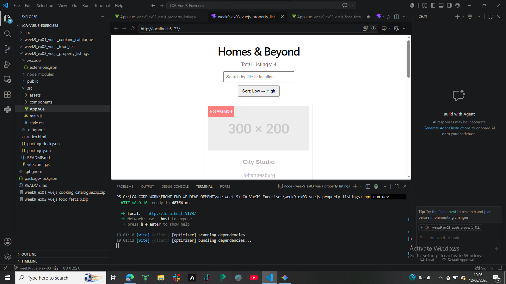

roperty Mini-Listings
Project Overview
This Vue.js single-page application displays a collection of rental properties. Users can search listings, sort them by price, bookmark favourites, and view availability information in a responsive interface.

Features
Dynamic property listings
Search by title or location
Sort by price
Bookmark functionality
Availability badges
Responsive layout
Installation
npm install
npm run dev
Technologies Used
Vue 3
Vite
JavaScript
HTML
CSS
Author
Ashley Batchi

Screenshot

